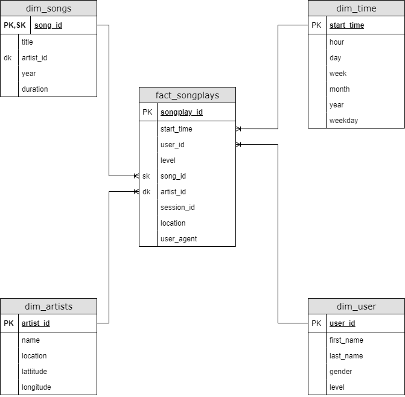

# DataWarehouse
## General Overview
Songify is a company that recently started acquiring a lot of data. In this case Songify maintains a song database and series of rapidly growing song play logs. The more their data grows, the more they realize that an on premise data infrastructure is getting difficult to maintain. They decided to implement a cloud data infrastructure in order to alleviate some of their pain points. Since cloud technology is set up and torn down through code, easily scalabe, and externally managed, they are able to focus on improving their product and no longer maintaining physical servers. Once songify built their data lake with S3, they decided to build a data warehouse on Redshift around the song log information. The schema is given below. This data warehouse allows them to answer questions around recently popular songs, and start making song recommendations with machine learning.

## Database Design
This schema is designed to answer questions around the song play logs. The lone fact table is details around each instance of a song play. The dimension tables are time, user, song, and artist details.

## ETL and Infrastructure
Extract - From S3
Transform - With SQL
Load - Into Redshift
Scripts - Python